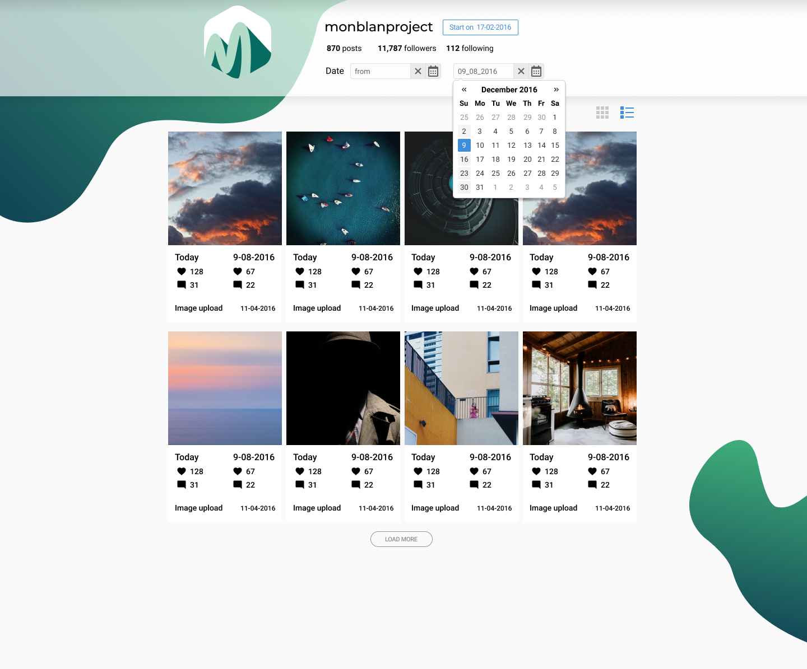

# WebSpark Markup

Develop a responsive landing page from a Figma mockup featuring a posts feed with Row and Tile views, a date range filter, and pagination.

## Stack

- [VITE](https://vite.dev/) — dev server & build
- [LESS](https://lesscss.org/) — styling
- [FLATPICKR](https://flatpickr.js.org/) — date picker
